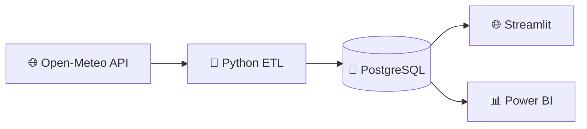
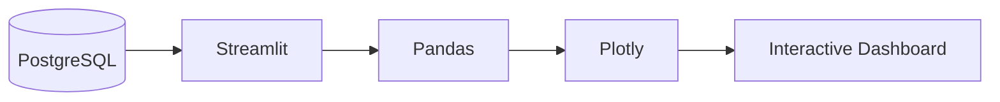
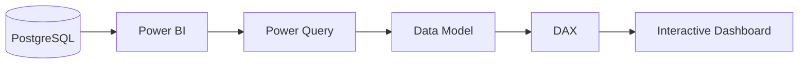

# 🌤️ Weather ETL Project

A Python-based **ETL (Extract, Transform, Load) pipeline** that retrieves hourly weather forecast data from the **Open-Meteo API**, transforms and validates the data using Pandas, and loads it into a PostgreSQL data warehouse running inside Docker.

The project is designed as a simple but complete data engineering workflow demonstrating:

* REST API data extraction
* Data transformation and validation
* Pandas DataFrames
* PostgreSQL database storage
* SQL schema design
* Docker and Docker Compose
* Environment-variable configuration
* SQL analytics queries
* Python project organization
* ETL pipeline architecture

Absolutely. Since you said yes, we can continue **without the file-generation tool**.

I can give you the complete, ready-to-paste `README.md` content here. It will be **a little longer than the simplified version we made before**, but still easy to read, with Mermaid diagrams and project visuals.

You can replace the contents of your existing `README.md` with this:

# 🌤️ Weather ETL Project

An end-to-end **Data Engineering + Analytics** project that collects hourly weather forecast data from the **Open-Meteo API**, transforms and validates it with Python, stores it in **PostgreSQL**, and presents the data through **Streamlit** and **Power BI** dashboards.

---

## 📌 Project Overview

This project demonstrates a complete modern data pipeline:



The overall workflow is:

**Extract → Transform → Validate → Load → Analyze**

### Main goals

* Collect weather data from a REST API
* Transform and validate the data using Python
* Store structured data in PostgreSQL
* Run PostgreSQL inside Docker
* Build an interactive Streamlit dashboard
* Build a Power BI analytics dashboard
* Practice SQL, data modeling, DAX, and visualization

---

# 🏗️ Architecture

```text
                    ┌─────────────────────┐
                    │   Open-Meteo API    │
                    │  Hourly Weather     │
                    └──────────┬──────────┘
                               │
                               ▼
                    ┌─────────────────────┐
                    │     EXTRACT         │
                    │      Python         │
                    └──────────┬──────────┘
                               │
                               ▼
                    ┌─────────────────────┐
                    │    TRANSFORM        │
                    │      Pandas         │
                    │                     │
                    │ Clean + Validate    │
                    └──────────┬──────────┘
                               │
                               ▼
                    ┌─────────────────────┐
                    │       LOAD          │
                    │     PostgreSQL      │
                    └──────────┬──────────┘
                               │
                     ┌─────────┴─────────┐
                     ▼                   ▼
              ┌──────────────┐    ┌──────────────┐
              │  Streamlit   │    │   Power BI   │
              │  Dashboard   │    │  Dashboard   │
              └──────────────┘    └──────────────┘
```

The PostgreSQL database acts as the central data layer for both dashboards.

---

# 🛠️ Technologies

| Technology         | Purpose                   |
| ------------------ | ------------------------- |
| **Python**         | ETL pipeline              |
| **Pandas**         | Data transformation       |
| **Requests**       | API communication         |
| **SQLAlchemy**     | Database connection       |
| **Psycopg2**       | PostgreSQL driver         |
| **PostgreSQL 16**  | Data storage              |
| **Docker**         | Containerization          |
| **Docker Compose** | PostgreSQL management     |
| **SQL**            | Database and analytics    |
| **Streamlit**      | Interactive web dashboard |
| **Plotly**         | Data visualization        |
| **Power BI**       | Business intelligence     |
| **DAX**            | Power BI calculations     |
| **python-dotenv**  | Environment configuration |

---

# 📂 Project Structure

```text
Weather_ETL_project/
│
├── .env
├── .env.example
├── .gitignore
├── docker-compose.yml
├── requirements.txt
├── README.md
├── run.py
│
├── dashboard/
│   └── app.py
│
├── src/
│   ├── __init__.py
│   ├── config.py
│   ├── extract.py
│   ├── transform.py
│   ├── load.py
│   └── main.py
│
└── sql/
    ├── schema.sql
    └── queries.sql
```

---

# 🔄 ETL Pipeline

## 1. Extract

The extraction stage retrieves hourly weather forecast data from Open-Meteo.

The request includes information such as:

* Latitude
* Longitude
* Location
* Time zone
* Forecast period
* Temperature
* Humidity
* Precipitation
* Wind speed
* Weather code

```text
Open-Meteo API
      │
      ▼
  extract.py
      │
      ▼
  Raw weather data
```

---

## 2. Transform

The transformation stage converts the API response into a clean and structured Pandas DataFrame.

Example mappings:

```text
temperature_2m
      ↓
temperature_c

relative_humidity_2m
      ↓
humidity_pct

precipitation
      ↓
precipitation_mm

wind_speed_10m
      ↓
wind_speed_kmh

time
      ↓
observed_at
```

The transformation process includes:

* Selecting required fields
* Renaming columns
* Converting timestamps
* Adding location information
* Removing duplicates
* Validating required data

---

## 3. Load

The transformed DataFrame is loaded into PostgreSQL.

```text
Clean DataFrame
      ↓
SQLAlchemy
      ↓
PostgreSQL
      ↓
weather_hourly
```

The database uses a uniqueness constraint to prevent duplicate observations for the same location and timestamp.

---

# 🐘 PostgreSQL

The main weather table is:

```text
weather_hourly
```

### Main columns

| Column             | Description                  |
| ------------------ | ---------------------------- |
| `id`               | Primary key                  |
| `location_name`    | Weather location             |
| `latitude`         | Latitude                     |
| `longitude`        | Longitude                    |
| `timezone`         | Location timezone            |
| `observed_at`      | Weather observation time     |
| `temperature_c`    | Temperature in Celsius       |
| `humidity_pct`     | Relative humidity            |
| `precipitation_mm` | Precipitation in millimeters |
| `wind_speed_kmh`   | Wind speed                   |
| `weather_code`     | Open-Meteo weather code      |
| `loaded_at`        | ETL load timestamp           |

---

# 🐳 Docker

PostgreSQL runs inside a Docker container using Docker Compose.

```text
┌──────────────────────────────┐
│       Docker Container       │
│                              │
│       PostgreSQL 16          │
│                              │
│  Database: weather_dw        │
│  User: weather               │
│  Port: 5432                  │
│                              │
└──────────────────────────────┘
```

### Start PostgreSQL

```bash
docker compose up -d
```

### Check the container

```bash
docker compose ps
```

### Stop PostgreSQL

```bash
docker compose down
```

---

# ⚙️ Setup

## 1. Clone the repository

```bash
git clone <https://github.com/Youssef-fathy-elsayd-ibrahim/Weather_ETL_project.git>
cd Weather_ETL_project
```

## 2. Create a virtual environment

### Windows

```powershell
python -m venv .venv
.venv\Scripts\Activate.ps1
```

## 3. Install dependencies

```bash
pip install -r requirements.txt
```

## 4. Configure environment variables

Create a `.env` file:

```env
DB_HOST=localhost
DB_PORT=5432
DB_NAME=weather_dw
DB_USER=weather
DB_PASSWORD=weather

LATITUDE=30.0444
LONGITUDE=31.2357
LOCATION_NAME=Cairo
TIME_ZONE=Africa/Cairo
FORECAST_DAYS=7
```

> ⚠️ Do not commit your `.env` file to GitHub. Keep your credentials private.

---

# ▶️ Run the ETL Pipeline

First start PostgreSQL:

```bash
docker compose up -d
```

Then run the ETL pipeline:

```bash
python run.py
```

The pipeline executes:

```text
Extract
   ↓
Transform
   ↓
Validate
   ↓
Load
```

After a successful run, the weather data will be available in:

```text
PostgreSQL
    ↓
weather_dw
    ↓
weather_hourly
```

---

# 🔎 Verify the Database

To inspect the weather data:

```bash
docker compose exec postgres psql -U weather -d weather_dw -c "SELECT * FROM weather_hourly LIMIT 5;"
```

To check the number of records:

```bash
docker compose exec postgres psql -U weather -d weather_dw -c "SELECT COUNT(*) FROM weather_hourly;"
```

---

# 🌐 Streamlit Dashboard

The Streamlit application reads weather data directly from PostgreSQL.



### Dashboard features

* 🌡️ Latest temperature
* 💧 Humidity
* 🌬️ Wind speed
* 🌧️ Precipitation
* 📈 Temperature trend
* 📈 Humidity trend
* 📈 Wind speed trend
* 💨 Top 10 windiest hours
* 🌧️ Hours with precipitation
* 📅 Daily summary
* 📄 Raw weather data
* 📅 Date-range filtering

### Run Streamlit

```bash
streamlit run dashboard/app.py
```

Then open the local Streamlit address shown in the terminal.

---

# 📊 Power BI Dashboard

Power BI provides a second analytics layer using the same PostgreSQL database.



### Connection

Power BI connects to:

```text
Server: localhost:5432
Database: weather_dw
Table: weather_hourly
```

For this project, the recommended connectivity mode is:

```text
Import
```

This allows Power BI to load the weather dataset into its in-memory model for fast interactive analysis.

### Planned dashboard analysis

* 🌡️ Average temperature
* 🔥 Maximum temperature
* ❄️ Minimum temperature
* 💧 Average humidity
* 🌬️ Average wind speed
* 🌧️ Total precipitation
* 📈 Temperature trends
* 📈 Humidity trends
* 📈 Wind-speed trends
* 💨 Top 10 windiest hours
* 📅 Date filtering
* 📍 Location filtering
* 📊 Daily weather analysis

---

# 📐 Power BI Data Model

A dedicated date table can be used for time-based analysis.

```text
┌──────────────────┐             ┌─────────────────────┐
│    DateTable     │             │    weather_hourly   │
├──────────────────┤             ├─────────────────────┤
│ Date             │  1       *  │ Date                │
│ Year             │─────────────│ observed_at         │
│ Month            │             │ temperature_c       │
│ Month Number     │             │ humidity_pct        │
│ Day              │             │ precipitation_mm    │
│ Day Name         │             │ wind_speed_kmh      │
│ Year Month       │             │ weather_code        │
└──────────────────┘             └─────────────────────┘
```

Example DAX measures:

```DAX
Average Temperature =
AVERAGE(weather_hourly[temperature_c])
```

```DAX
Maximum Temperature =
MAX(weather_hourly[temperature_c])
```

```DAX
Minimum Temperature =
MIN(weather_hourly[temperature_c])
```

```DAX
Average Humidity =
AVERAGE(weather_hourly[humidity_pct])
```

```DAX
Total Precipitation =
SUM(weather_hourly[precipitation_mm])
```

---

# 📈 Analytics

The project provides several ways to analyze the same weather dataset:

```text
                   Weather Data
                        │
            ┌───────────┴───────────┐
            ▼                       ▼
       PostgreSQL                 Python
            │                       │
            ▼                       ▼
          SQL                  Pandas
            │                       │
            └───────────┬───────────┘
                        ▼
                 Visualization
                   /       \
                  ▼         ▼
             Streamlit   Power BI
```

Example questions the project can answer:

* What is the average temperature?
* What was the hottest hour?
* What was the coldest hour?
* Which hours had the strongest wind?
* When did precipitation occur?
* How did temperature change throughout the forecast?
* What is the daily average temperature?
* How does humidity change over time?

---

# 🧪 Data Quality

The pipeline includes basic data-quality practices:

* Duplicate prevention
* Required-value validation
* Timestamp conversion
* Consistent column naming
* Database uniqueness constraints
* Database indexing
* Transaction-based loading

These controls help ensure that the dashboards work with reliable and structured data.

---

# 🚀 Skills Demonstrated

This project combines skills from **Data Engineering, Data Analysis, and Business Intelligence**.

### 🐍 Python

* Python programming
* Pandas
* REST APIs
* Requests
* SQLAlchemy
* Environment configuration
* Modular project structure

### 🏗️ Data Engineering

* ETL pipelines
* Data extraction
* Data transformation
* Data validation
* PostgreSQL
* SQL
* Database design
* Docker
* Docker Compose

### 📊 Analytics & BI

* Streamlit
* Plotly
* Power BI
* DAX
* Data modeling
* KPI development
* Interactive dashboards
* Time-series analysis

---

# 🔮 Future Improvements

Possible future extensions include:

* 🌍 Support multiple cities
* 📅 Store historical weather data
* ⏰ Schedule automatic ETL execution
* 🧪 Add automated tests
* 📝 Improve pipeline logging
* ⭐ Add a proper star schema
* 🌦️ Add a weather-code dimension
* ☁️ Deploy the application to the cloud
* 🔄 Add CI/CD with GitHub Actions
* 📊 Publish the Power BI report
* 🐳 Containerize the Streamlit application
* 🔍 Add automated data-quality monitoring

---

# 🎯 Project Value

This project demonstrates a complete flow from **raw external data to useful business insights**:

```text
🌐 External API
       ↓
🐍 Python ETL
       ↓
🧹 Clean & Validate
       ↓
🐘 PostgreSQL
       ↓
┌──────┴──────┐
↓             ↓
🌐 Streamlit  📊 Power BI
↓             ↓
└──────┬──────┘
       ↓
📈 Weather Analytics
```

Instead of being only a weather dashboard, the project demonstrates how a data engineer can:

**collect → process → store → model → analyze → visualize data.**

---

## 👨‍💻 Author

**Youssef Fathy**

- A practical Data Engineering project built with:

**Python • PostgreSQL • Docker • Streamlit • Power BI**

## note:
- The project can serve as a foundation for more advanced data engineering features such as scheduling, data-quality monitoring, multiple locations, dashboards, automated testing, and production-grade upsert handling.

- this README.md was generated using an ai tool (to make it easy on my self) so it might not be as easy for you (lovly fluffy bro programmer) to under stand it steps; i even don't fully understand steps that is generated :-) , so don't get frustraited, i have high hope that i'm gonna change it to much simpler and easy to understand readme.md file, but untill then, see yaa...